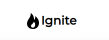

<div id="top"></div>

<!-- PROJECT LOGO -->
<br />
<div align="center">
  <a href="https://github.com/zawojweb/GameApp">
    
  </a>

<h3 align="center">Game App</h3>

  <p align="center">
    App where you can search games
    <br />
    <br />
    <a href="https://gameapp.zawojweb.com/">View Demo</a>
    ·
    <a href="https://github.com/ZawojWeb/GameApp">Report Bug</a>
  </p>
</div>

<details>
  <summary>Table of Contents</summary>
  <ol>
    <li>
      <a href="#about-the-project">About The Project</a>
      <ul>
        <li><a href="#built-with">Built With</a></li>
      </ul>
    </li>
    <li>
      <a href="#getting-started">Getting Started</a>
      <ul>
        <li><a href="#prerequisites">Prerequisites</a></li>
        <li><a href="#installation">Installation</a></li>
      </ul>
    </li>
  </ol>
</details>

<!-- ABOUT THE PROJECT -->
## About The Project

Application which render games from API. 

<p align="right">(<a href="#top">back to top</a>)</p>

### Built With

* [React.js](https://reactjs.org/)
* [Redux](https://redux.js.org/)


<p align="right">(<a href="#top">back to top</a>)</p>

<!-- GETTING STARTED -->
## Getting Started

### Prerequisites

To run project localy, you have to have [Node.js](https://nodejs.org/en/download/) instaled on your machine


### Installation

1. Get a free API Key at [Rawg](https://rawg.io/)
2. Clone the repo
   ```sh
   git clone https://github.com/ZawojWeb/GameApp.git
   ```
3. Install NPM packages
   ```sh
   npm install
   ```
4. Enter your API in `.env`
   ```js
    REACT_APP_KEY_API = 'ENTER YOUR API';
   ```

<p align="right">(<a href="#top">back to top</a>)</p>
